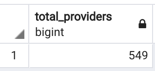
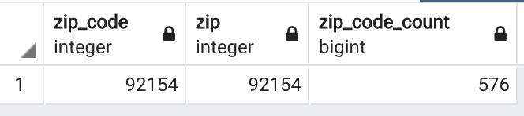

# California-Child-Care-Providers
Create an ETL service that will Aggregate Data from 3 Sources to Extract Insights on California Child Care Providers

## Objective
Create an ETL service that will aggregate data from 3 sources to extract insights on California Child Care Providers

## Data Sources
1. Internal API data 
2. CSV file 
3. Naccrra OMCC Provider Database 

## Installation Guide
The following tools were utilized for ETL service:

#### Tools used for Extracting Data
- JSON
    - Lightweight format for storing and transporting data
    - Used to help extract data from API 
- Splinter
    - Tool for testing web applications using Python
    - Used to automate browser actions in the online Naccrra database
- Beautiful Soup
    - Python library to pull data out of HTML/XML files
    - Used to help extract data from the online Naccrra database

#### Tools used for Transforming Data
- Pandas Python
    - Open source data analysis and manipulation tool to help clean and normalize data
    - Used throughout the project to convert data into dataframes 

#### Tools used for Loading Data
- SQL Alchemy 
    - SQL tool and object-relational mapper (ORM) for the Python programming language
    - Used to create connection between database and jupyter notebook
- pgAdmin
    - Management tool for PostgreSQL and derivative relational databases
    - Used to store database
    
## Process

1. Created a database called `child_care_centers_db` in PostgreSQL 

2. ETL Process for CSV
    - Read CSV file using Jupyter Notebook to transform and normalize data using Python Pandas library
    - Created `csv_table` in `child_care_centers_db` for csv data
    
    ```SQL
    CREATE TABLE csv_table(
        id SERIAL PRIMARY KEY,
        child_care_provider VARCHAR,
        type_of_child_care VARCHAR,
        address VARCHAR,
        city VARCHAR,
        state VARCHAR,
        zip_code INT,
        other FLOAT); 
     ```
    - Connected to local database by creating engine with SQLAlchemy
    - Used Python Pandas to load csv converted Dataframe into `child_care_centers_db`


3. ETL Process for API
    - Used Python to retrieve data from the provided API url and then converted it into JSON
    - Converted JSON to Dataframe to normalize and clean data with Python Pandas
    - Created `api_table` in `child_care_centers_db` for api data
    
    ```SQL 
    CREATE TABLE api_table(
        id SERIAL PRIMARY KEY,
        id_1 VARCHAR,
        email VARCHAR,
        owner_name VARCHAR,
        phone VARCHAR,
        provider_name VARCHAR
    );
    ```
    - Connected to local database 
    - Load dataframe into `child_care_centers_db`


4. ETL Process for Naccrra OMCC Provider Database </b>
    - Read HTML file in Python and created Beautiful Soup object
    - Identified element that contains all data of table 
    - Extracted data for each row as a list and append to master list
    - Converted list to Dataframe using Pandas 
    - Created `naccrra_table` in `child_care_centers_db` for Naccrra OMCC data
    ```SQL
    CREATE TABLE naccrra_table(
        id SERIAL PRIMARY KEY,
        provider_name VARCHAR,
        type_of_care VARCHAR,
        address VARCHAR,
        city VARCHAR,
        state VARCHAR,
        zip INT,
        phone VARCHAR,
        email VARCHAR);
    ```
    - Connected to local database to then load Dataframe into `child_care_centers_db` 
    
    
5. Perform query to aggregate all datasets together to identify duplicates and extract insights 

## Analysis
1. How many Family Child Care Home providers are there in the dataset?

```SQL
SELECT COUNT(*) as total_providers
FROM (
	SELECT t1.child_care_provider as provider_csv, t2.provider_name as provider_api, 
		t3.provider_name as provider_naccrra, COUNT(*) AS duplicate_count
	FROM csv_table as t1
	FULL OUTER JOIN api_table as t2
	ON t1.child_care_provider = t2.provider_name
	FULL OUTER JOIN naccrra_table as t3
	ON t3.provider_name = t2.provider_name
	WHERE t1.type_of_child_care = 'Family Child Care Home' AND t3.type_of_care = 'Family Child Care Home'
	GROUP BY t1.child_care_provider, t2.provider_name, t3.provider_name
	HAVING COUNT(*) >= 1
	ORDER BY COUNT(*) DESC
) as provider_table;
```
    
#### Answer: 549 Family Child Care Home Providers

 

2. Which Zip code has the most providers? 
``` SQL
SELECT t1.zip_code, t3.zip, COUNT(*) as zip_code_count
    FROM csv_table as t1
    FULL OUTER JOIN naccrra_table as t3
    ON t1.zip_code = t3.zip 
    GROUP BY t1.zip_code, t3.zip
    ORDER BY zip_code_count DESC;
```
#### Answer: 92154

 

## Tradeoffs
- Improve code for better performance
- Design extensive QA plan to ensure there aren't any additional duplicates (mispelling, abbreviations, etc)
- Confirm SQL queries by cross checking and performing same analysis in Python 

